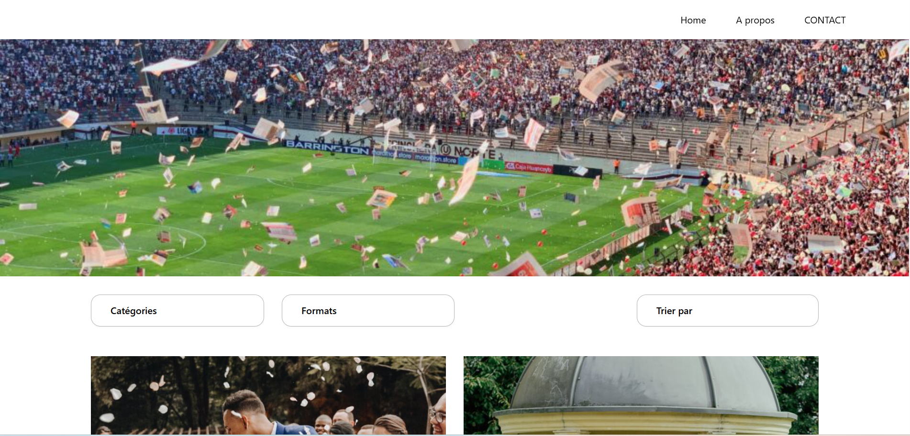

# Ma Photo

Projet de développement d’un thème WordPress personnalisé pour une plateforme de photographie fictive, réalisé dans le cadre de ma formation de développeur WordPress.

---

## Fonctionnalités

- Galerie photo dynamique
- Menu responsive mobile
- Hero personnalisé
- Templates WordPress custom
- Navigation AJAX
- Responsive design
- Optimisation mobile

---

## Aperçu du thème



---

# Important

Le thème `Ma Photo` est un **thème enfant basé sur Astra**.

Le thème parent Astra doit obligatoirement être installé pour que le projet fonctionne correctement.

Télécharger Astra :

https://wordpress.org/themes/astra/

---

## Installation avec Local

### 1. Installer Local

Télécharger Local :

https://localwp.com/

---

### 2. Créer un site WordPress

- Ouvrir Local
- Cliquer sur `Create New Site`
- Nom du site : `nathalie-mota`
- Environment : `Preferred`

---

### 3. Installer le thème Astra

Télécharger puis installer le thème parent Astra dans :

```txt
wp-content/themes/
```

Le dossier doit ressembler à ceci :

```txt
wp-content/themes/
├── astra
└── maphoto
```

---

### 4. Copier le thème enfant

Copier le dossier :

```txt
maphoto
```

dans :

```txt
wp-content/themes/
```

---

## Import de la base de données

Le projet utilise une base de données contenant :

- les plugins
- les réglages WordPress
- les médias
- les pages
- les contenus du projet

### Étapes

1. Ouvrir Adminer via Local
2. Importer le fichier `.sql`
3. Modifier les URLs du site

```sql
UPDATE wp_options 
SET option_value = 'http://nathalie-mota.local'
WHERE option_name IN ('siteurl', 'home');
```

---

## 🔌 Plugins nécessaires

Même après l'import de la base de données, certains plugins doivent être installés manuellement car la base SQL ne contient pas les fichiers des extensions.

### Plugins obligatoires

#### Contact Form 7

Installer le plugin :

https://wordpress.org/plugins/contact-form-7/

Le plugin est nécessaire au bon fonctionnement du formulaire de contact du projet.

---

## Important

La base de données importe :

- les réglages des plugins
- les formulaires
- les options WordPress

Mais les fichiers des plugins doivent être présents dans :

```txt
wp-content/plugins/
```

Sinon certaines fonctionnalités du site peuvent provoquer des erreurs.

---

## Important après import SQL

Même après import de la base de données, le thème parent Astra doit être présent dans :

```txt
wp-content/themes/astra
```

Sinon WordPress ne pourra pas charger le thème enfant `maphoto`.

---

## Lancer le projet

Une fois l'installation terminée :

- démarrer le site dans Local
- accéder à :

```txt
http://nathalie-mota.local
```
## Configuration base de données Local

| Paramètre | Valeur |
|---|---|
| Host | `localhost` |
| Port | `10005` |
| Database | `local` |
| User | `root` |
| Password | `root` |

> Le port peut varier selon la configuration Local.
---

## Structure du thème

```txt
maphoto/
├── images/
├── js/
├── template-parts/
├── functions.php
├── header.php
├── footer.php
├── style.css
└── index.php
```

---

## Technologies utilisées

- WordPress
- Astra Theme
- PHP
- JavaScript
- CSS
- Local WP
- Git
- GitHub
- AJAX
---

## Captures

### Homepage


### Navigation mobile


---

## Auteur

Fabien Mari

GitHub :
https://github.com/Graphikfm
